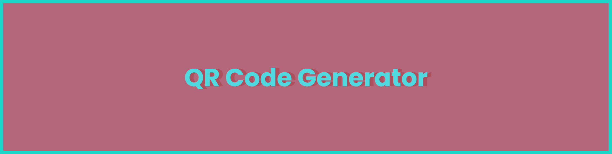

# What is the project about?

It is just a simple QR Generator frontend using [node-qrcode](https://github.com/soldair/node-qrcode). Whole heavy lifting is done by the package and it is also bundled for the browser.

This application is just for trying new things like theming and coloring using Svelte goodies.

# What do I need to run this project?

The client is hosted at this website. But to start dev server, you need:

1. Node.JS
2. PNPM (You can still use npm or yarn or bun?)
3. IDE of your choice. VSCode is used here.
4. Understanding of Svelte.

# To-Dos

- [ ] Theming to make it more dynamic.
- [ ] Expose all values to frontend.
- [ ] Change the design a bit to adapt all sizes.

# Credits

1. [node-qrcode](https://github.com/soldair/node-qrcode) by soldair
